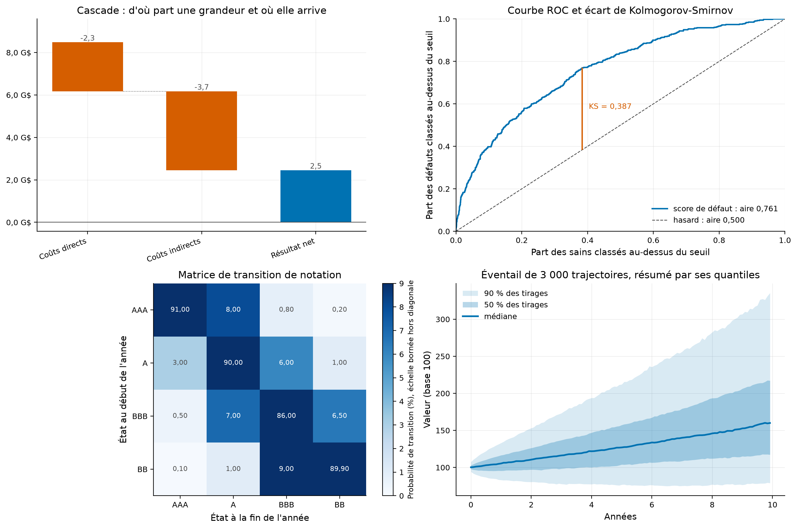
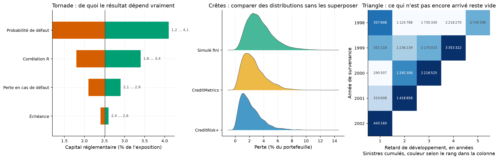

# gv-fintools : la feuille de style des figures du portefeuille, et son rapport PDF

Les vingt-cinq dépôts du portefeuille produisent des figures et des rapports. Ils le faisaient chacun
de leur côté, en recopiant la même palette et la même fonction de réglage. Cet outil met les deux
choses à un seul endroit.

[](https://github.com/Guilou001/gv-fintools/actions/workflows/ci.yml)


**Résultat en une phrase.** Sept fabriques de figures qui rendent les nombres qu'elles dessinent, une
feuille de style qui écrit les axes en français et enregistre en PNG et en PDF vectoriel, et une
commande qui transforme le README d'un dépôt en rapport composé : **29 tests fermés**, dont un qui
compile un document entier et relit le PDF produit.

*Summary in English. A shared plotting layer for a portfolio of finance repositories: seven chart
factories (waterfall, ROC and KS, transition matrix, fan chart, tornado, ridgeline, run-off
triangle), a French-locale style sheet with vector output, and a Markdown to Typst report generator.
Every factory returns the numbers it draws, so the tests check arithmetic rather than pixels.*

## 1. Les deux problèmes que cet outil règle

**Le premier est la duplication.** Mesuré le 2026-08-30 sur les 399 fichiers Python du portefeuille :
la palette est recopiée dans **24 fichiers** et la fonction de réglage redéfinie **21 fois**. Une
correction de graisse de trait devait donc être faite vingt et une fois, et ne l'était jamais. Pire,
**13 des 20 appels d'enregistrement n'écrivaient que du PNG**, si bien que la moitié des figures
n'existait sous aucune forme vectorielle et se pixelisait dans les rapports imprimés.

**Le second est qu'une figure ne se teste pas.** Une fonction qui ne rend que des pixels ne peut
être contredite par aucun test : elle peut être vraie et ne rien montrer, ou montrer quelque chose de
faux sans que rien ne le signale. C'est la règle que l'audit du 2026-08-29 a coûté cher à apprendre.

La réponse tient en une décision : **chaque fabrique dessine et renvoie les nombres qu'elle a
dessinés**. Le test porte sur les nombres, le dessin n'est plus qu'une mise en forme de ce qui a déjà
été vérifié.

## 2. Les sept fabriques





Comment lire ces deux planches : chaque panneau est produit par un appel unique à la fabrique du même
nom, sur des données de démonstration, et le code qui les engendre tient dans le fichier de test.

| Fabrique | Ce qu'elle répond | Ce qu'elle renvoie |
|---|---|---|
| `cascade` | d'où part une grandeur, ce qui l'augmente, ce qui la diminue, où elle arrive | les cumuls, départ compris |
| `roc_ks` | un score de défaut sépare-t-il les défaillants des sains, et à quel seuil | aire, Gini, écart de Kolmogorov-Smirnov, seuil qui l'atteint |
| `matrice_transition` | comment les notations migrent d'une année sur l'autre | la matrice telle qu'elle est dessinée |
| `eventail` | quelle incertitude porte un jeu de trajectoires simulées | les quantiles, série par série |
| `tornade` | de quelle hypothèse le résultat dépend vraiment | l'ordre de tri, par amplitude |
| `ridgeline` | comment se comparent plusieurs distributions de pertes | moyenne, médiane et mode par groupe |
| `triangle` | comment les sinistres d'une année se développent avec le retard | la matrice, cases vides comprises |

Comment lire ce tableau, en trois constats. Le premier est que la colonne de droite est la raison
d'être du module : elle est ce sur quoi les tests portent. Le deuxième est que trois décisions de
dessin y sont figées parce qu'elles sont fausses par défaut ailleurs, la barre de total d'une cascade
partant de zéro et non du cumul précédent, l'échelle d'une matrice de transition étant bornée au plus
grand terme **hors diagonale** sans quoi une persistance de 91 % écrase toutes les migrations, et
l'aire sous la courbe ROC étant calculée par la statistique de Mann et Whitney, donc exactement,
ex aequo compris. Le troisième est que la fabrique du triangle laisse vides les cases qui ne sont pas
encore arrivées, au lieu de les remplir de zéros : c'est exactement ce qu'un provisionnement doit
estimer.

## 3. La méthode, pas à pas

1. **Appliquer le style** une fois par module de figures, par `style.appliquer()`.
2. **Appeler la fabrique** sur un axe matplotlib ordinaire ; elle ne crée ni figure ni axe, donc elle
   se compose librement avec le reste.
3. **Lire ce qu'elle renvoie** et l'écrire dans `results/`, pour que le README cite un fichier et non
   un souvenir.
4. **Enregistrer** par `style.enregistrer(fig, dossier, nom)`, qui écrit le PNG du README et le PDF
   vectoriel du rapport côte à côte.
5. **Engendrer le rapport** par `gvf rapport <depot>`, qui traduit le README en Typst et le compile.

## 4. Ce que le traducteur de rapport couvre

Il ne couvre pas tout le Markdown, seulement ce que les README du portefeuille emploient.

| Élément Markdown | Ce qu'il devient |
|---|---|
| Titres de niveau 2 à 6 | titres Typst, celui de niveau 1 devenant le titre du document |
| Gras, italique, code en ligne | les marques équivalentes, le texte alentour échappé |
| Liens | `#link`, l'adresse conservée telle quelle |
| Citations | blocs cités, à filet vertical et en italique |
| Tableaux | `#table`, en-tête en gras et filet sous la première ligne |
| Images relatives | `#figure` numérotée, avec sa légende |
| Images distantes | retirées : ce sont les écussons d'état, sans objet sur du papier |
| Blocs de code | `#raw` avec coloration syntaxique |
| Listes à puces et numérotées | listes Typst, les lignes de continuation rattachées à leur élément |

Comment lire ce tableau, en trois constats. D'abord, la distinction entre image relative et image
distante est ce qui sépare une figure du dépôt d'un écusson d'état ; la première version confondait
les deux et perdait toutes les figures. Ensuite, chaque texte qui n'est pas une structure reconnue est
échappé caractère par caractère, faute de quoi un dièse ou une étoile du texte deviendrait une
instruction Typst. Enfin, rien n'est ajouté au README : le rapport ne peut pas dire autre chose que
lui.

## 5. S'en servir

```bash
uv sync --locked --all-extras
uv run pytest                              # 29 tests fermés, sans réseau
uv run gvf rapport /chemin/vers/un/depot   # écrit rapport/rapport.pdf
```

Dans un dépôt qui consomme le paquet, l'appel type tient en cinq lignes.

```python
import matplotlib.pyplot as plt
from gvf.style import appliquer, enregistrer, formateur
from gvf.figures import roc_ks

appliquer()
fig, ax = plt.subplots(figsize=(6.4, 5.2))
mesures = roc_ks(ax, defaut_observe, score_du_modele)   # dessine ET renvoie
ax.set_title(f"Le score sépare : aire {mesures['aire']:.3f}, Gini {mesures['gini']:.3f}")
enregistrer(fig, "results/figures", "roc")
```

Les fabriques et le style vivent dans l'extra `figures`, qui tire matplotlib et numpy. Le générateur
de rapport n'en dépend pas : un dépôt qui ne veut que le PDF n'installe ni l'un ni l'autre.

## 6. Limites, avec leur statut

| Limite | Statut |
|---|---|
| Les vingt-cinq dépôts existants n'ont pas été convertis à `gvf.style` | déclaré ; la conversion touche 24 fichiers et se fera dépôt par dépôt, à l'occasion d'une modification |
| Le lissage de `ridgeline` emploie la règle de Silverman, qui suppose une densité proche de la normale | reconnu ; sur une distribution très asymétrique elle lisse trop, et le mode renvoyé porte l'erreur d'échantillonnage, mesurée à 0,11 sur 40 000 tirages |
| La couleur du triangle suit le rang dans la colonne, pas la valeur brute | déclaré, et écrit sous l'axe ; sans cela les colonnes anciennes, seules complètes, écraseraient l'échelle |
| Le Markdown couvert est celui des README du portefeuille, pas la norme complète | déclaré ; listes imbriquées, notes de bas de page et HTML brut ne sont pas traduits |
| Les tableaux très larges débordent en petits caractères plutôt que de se replier | reconnu ; un tableau de neuf colonnes reste dense |
| La version 0.1 rendait des tableaux vides, sa règle de mise en forme enfermant la table dans un `par()` que Typst supprime sans lever d erreur | corrigé en 0.2.1, et un test compile désormais un document et cherche les cellules DANS le PDF ; les 24 rapports produits avant cette date sont à régénérer |
| La police est celle du système, avec Helvetica en premier choix | déclaré ; un poste sans Helvetica prendra Arial puis DejaVu Sans, qui porte bien l'espace fine insécable du séparateur de milliers, vérifié dans sa table de caractères |

## 7. Crédits, licence, citation

Écrit en 2026 pour le portefeuille Finance de Guillaume Vaudescal. Code sous licence MIT. La palette
est celle d'Okabe et Ito, choisie parce que ses huit couleurs restent distinguables par les trois
formes courantes de daltonisme.
